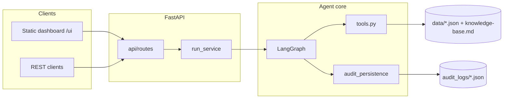
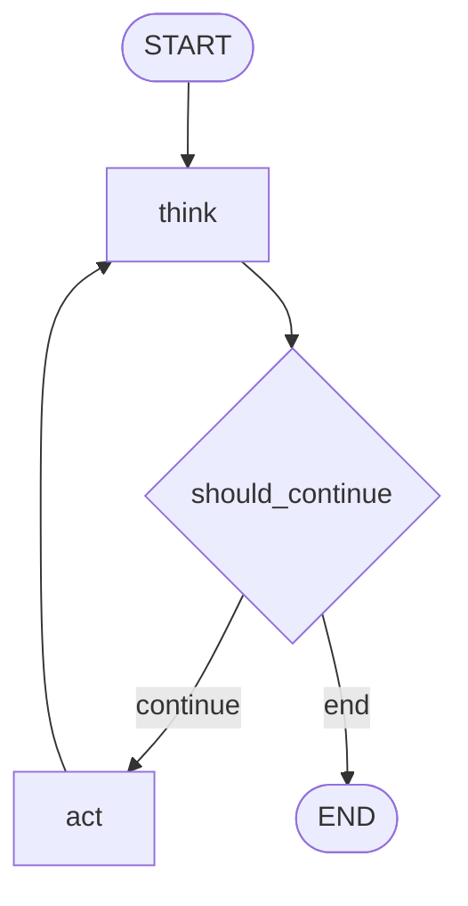

# ShopWave agent — architecture

This document describes how the autonomous support agent is structured: the **LangGraph** think/act loop, **deterministic pipeline** ordering, **domain tools**, **LLM** usage, **output validation**, **fault injection**, and how the **FastAPI** service and **dashboard** sit around it.

---

## 1. High-level system

- **Dashboard** (`frontend/static/`) calls HTTP endpoints under the same origin (e.g. `/run`, `/status`, `/tickets`).
- **`run_service`** starts a background batch: for each ticket it invokes **`agents.runner.run_one_ticket`**, which runs the compiled **LangGraph** once per ticket.
- **Data** is read-only JSON and markdown loaded at startup (`utils/load_data.py`). **Audit** append-only JSON is written under `audit_logs/` (per ticket + `escalations.json`).

---

## 2. LangGraph: think → act loop

The graph is defined in `agents/graph.py`:

| Node | Role |
| ---- | ---- |
| `think` | Chooses the next pipeline step, runs **LLM thought + confidence** (unless routing ends early), may **escalate** on low confidence or missing order id. |
| `act` | Executes exactly one **tool** for the current step, appends to `messages`, updates state, writes an **audit** step. |

Control flow:

- **`should_continue`** (`agents/nodes.py`): if `next_step == "done"` → **end**; else → **act**.
- **Recursion limit** is set when invoking the graph (e.g. 64) so LangGraph cannot loop forever; additional safety uses **`think_cycle`** (cap at 28) inside `think`.

---

## 3. Deterministic pipeline ordering

Tool order is **not** free-form LLM tool-calling. `agents/pipeline.py` implements **`pipeline_next_step(state)`**, which inspects **`messages`** (lines like `tool_name: {output}`) and returns the next step name or `None` / `"done"`.

Typical sequence:

1. `classify_ticket`
2. `search_knowledge_base`
3. `get_customer` (if email present)
4. **`resolve_order_id`** must yield an order id (ticket text, message blob, or latest order after `get_customer`) — otherwise **`None`** → escalate (missing order id).
5. `get_order` → `get_product` → `check_refund`
6. If eligibility shows **eligible: True** → `issue_refund`
7. `send_reply` → **`done`**

Refund and reply steps are gated on **string markers** in the accumulated message blob (e.g. `eligible': True`) for `issue_refund`, matching the serialized tool output format.

---

## 4. State: `AgentState`

`agents/state.py` defines a **`TypedDict`** carrying everything the graph needs: ticket text, ids, **`messages`**, **`next_step`**, **`thought` / `confidence`**, **`classification`**, **`actions_taken`**, escalation flags, **`think_cycle`**, **`final_decision`**, etc. Nodes read and return partial updates; LangGraph merges them.

---

## 5. Tool layer

**Implementation:** `agents/tools.py` — pure functions over in-memory catalogs (`ORDERS`, `CUSTOMERS_*`, `PRODUCTS`, `KNOWLEDGE_BASE`).

**Execution path:** `agents/nodes.py` → **`_exec_tool(step, state)`** builds inputs, calls the tool (or synthetic error dicts when ids are missing), then **`validate_tool_output(step, raw)`** (`schemas/tool_outputs.py`).

- **Schema validation:** each step has a **Pydantic** model; failures raise **`ToolMalformedResponse`**, which participates in the same **retry** path as timeouts and simulated malformed responses (`agents/chaos.py`).

---

## 6. LLM usage (`agents/llm.py`)

- **Groq** (`langchain_groq.ChatGroq`, `llama-3.1-8b-instant`) when `GROQ_API_KEY` is set and `SHOPWAVE_OFFLINE` is not set.
- **`llm_thought_confidence`:** after the pipeline picks the next action, produces a short **thought** line and a **confidence** float.
- **`generate_reply_message`:** builds the customer reply body when `send_reply` runs (unless a `reply_draft` is already in state).
- If the LLM is unavailable or offline mode is on, **deterministic strings** and fixed confidence values are used so the graph still completes.

---

## 7. Fault tolerance (`agents/chaos.py`)

**`run_with_retries`** wraps each tool execution:

- Optional **simulated** timeout / malformed response (`ToolTimeout`, `ToolMalformedResponse`) at a configurable rate (`SHOPWAVE_TOOL_FAILURE_RATE`).
- **Exponential backoff** between attempts; after max retries, **`ToolRetriesExhausted`** leads to **escalation** in `act`.

**Validation errors** from tool output schemas are raised as **`ToolMalformedResponse`**, so they are retried like other transient failures.

---

## 8. Audit and escalation

- **`append_audit_step`** / **`finalize_ticket_audit`** (`agents/audit_persistence.py`): append-only steps per run under `audit_logs/<ticket_id>.json` (locked I/O for concurrency).
- **`agents/escalation.py`:** appends to `audit_logs/escalations.json` when the agent escalates (low confidence, missing order id, max think cycles, tool failure after retries, etc.).

---

## 9. HTTP API surface

`app/api/routes.py` composes routers: **run** (start batch), **status**, **tickets**, **audit**, **analytics**, **escalations**, etc. These layers only orchestrate I/O and aggregation (`services/*`); they do **not** embed LangGraph construction logic (that stays under `agents/`).

---

## 10. Deployment shape

- **Dockerfile:** installs `requirements.txt`, copies `app/`, `data/`, `frontend/`, creates empty `audit_logs/`, runs **Uvicorn** on port 8000.
- **Runtime:** `PYTHONPATH` points at `app/`; repository root is **`REPO_ROOT`** in `core/config.py` (three levels above `app/core/config.py`), so `data/` and `audit_logs/` resolve next to `app/` in the container layout.

---

## 11. File map (agent-related)

| Path | Purpose |
| ---- | ------- |
| `agents/graph.py` | Compiles **StateGraph** (`think` / `act`). |
| `agents/nodes.py` | **think** / **act** / **`_exec_tool`** / validation hook-in. |
| `agents/pipeline.py` | **pipeline_next_step**, **resolve_order_id**, **kb_search_query**. |
| `agents/tools.py` | Domain tools. |
| `agents/state.py` | **AgentState** shape. |
| `agents/llm.py` | Groq + offline fallbacks. |
| `agents/chaos.py` | Retries + simulated failures. |
| `agents/runner.py` | **`run_one_ticket`**, **`run_all_tickets`**, thread pool for batches. |
| `schemas/tool_outputs.py` | Pydantic **tool output** schemas. |
| `core/config.py` | Paths to `data/`, `audit_logs/`. |

This matches the **think → act** loop with a **fixed tool pipeline**, **LLM-assisted confidence** at each think step, **validated tool outputs**, and **persistent audit** for observability and the dashboard.
